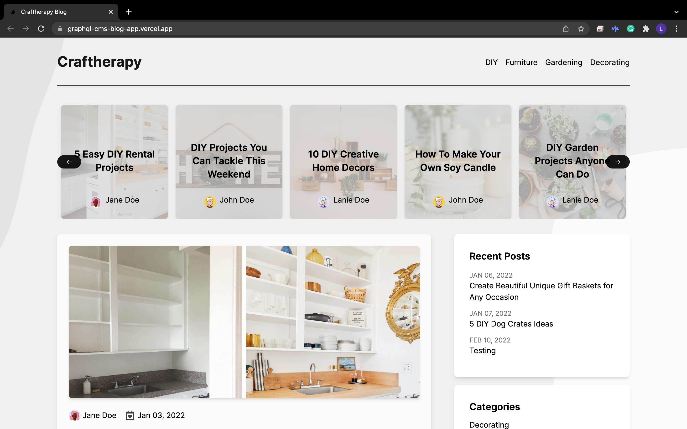

# Craftherapy - Custom Blog App

[Craftherapy](https://graphql-cms-blog-app.vercel.app/) is a custom blog app where you or your clients can easily manage blog posts. Features include full markdown articles with author information, publication date, featured images, comments, and more!




## Highlights

- Full markdown content
- Articles with images
- Featured post carousel
- Recent posts widget
- Tags and categories
- Author information
- Moderated user comments

## Key Technologies

- Node 14.17.3
- NPM 6.14.13
- React.js
- Next.js 
- GraphQL
- GraphCMS
- Tailwind CSS

## Overview
- Built with React 
- Nextjs pre-rendering with static generation 
- Created modern user interface using Tailwind CSS
- Created schemas and models with GraphQL 
- Uses GraphQL Queries to retrieve data
- GraphCMS for content management system

## Dev Setup

To get this project running locally, you'll need to create an account with [graphcms](https://www.graphcms.com) in which you'll create a schema and configure environment variables.

### 1. Getting started with GraphCMS

Go to [www.graphcms.com](https://www.graphcms.com) to create an account for free.

Next, create a new 'blank' project then input project name and description then select region.

### 2. Start creating your schema

You'll be creating four models to your schema where each model will include a 'Display name', 'API ID', and a 'Plural API ID'.

> Note: You will add multiple fields for each models accordingly.

<Details>
  <Summary>Create 'Author' Model</Summary>

Display name: Author > API ID: Author > Plural API ID: Authors

Add fields:

- Single line text:

  - Display name: Name
  - API ID: name
  - Select field options: Use as title field
  - Validations: Required

- Asset picker:

  - Display name: Photo
  - API ID: photo

- Multi line text:

  - Display name: Bio
  - API ID: bio

</Details>

<Details>
  <Summary>Create 'Categories' Model</Summary>

Display name: Category > API ID: Category > Plural API ID: Categories

Add fields:

- Single line text:

  - Display name: Name
  - API ID: name
  - Select field options: Use as title field
  - Validations: Required, Unique

- Slug:

  - Display name: Slug
  - API ID: slug
  - Slug options: Lowercase
  - Validations: Required, Unique
  - Match specific pattern dropdown: Slug
</Details>

<Details>
  <Summary>Create 'Comment' Model</Summary>

Display name: Comment > API ID: Comment > Plural API ID: Comments

Add fields:

- Single line text:

  - Display name: Name
  - API ID: name
  - Select field options: Use as title field
  - Validations: Required

- Single line text:

  - Display name: Email
  - API ID: email
  - Validations: Required

- Multi line text:

  - Display name: Comment
  - API ID: comment
  - Validations: Required
  
</Details>

<Details>
  <Summary>Create 'Post' Model</Summary>

Display name: Post > API ID: Post > Plural API ID: Posts

Add fields:

- Single line text:

  - Display name: Title
  - API ID: title
  - Select field options: Use as title field
  - Validations: Required

- Slug:

  - Display name: Slug
  - API ID: slug
  - Slug options: Lowercase
  - Validations: Required, Unique

- Multi line text:

  - Display name: Excerpt
  - API ID: excerpt
  - Validations: Required

- Rich text:

  - Display name: Content
  - API ID: content
  - Enable embedding: Post
  - Validations: Required

- Asset picker:

  - Display name: Featured Image
  - API ID: featuredImage
  - Validations: Required

</Details>

<Details>
  <Summary>Adding 'References' to Models</Summary>

You'll wrap up the schema by adding references fields to **each** model.

> Note: There are multiple references fields for the 'Post' model.

- Author -

  - Reference type: Allow only one model to be referenced
  - Model to reference: Post
  - Reference directions: Two-way reference
  - Relation cardinality: Allow multiple Posts per Author

- Category -

  - Reference type: Allow only one model to be referenced
  - Model to reference: Post
  - Reference directions: Two-way reference
  - Relation cardinality: Allow multiple Categories per Post, Allow multiple Posts per Category

- Comment -

  - Reference type: Allow only one model to be referenced
  - Model to reference: Post
  - Reference directions: Two-way reference
  - Relation cardinality: Allow multiple Comments per Post

- Post -

  - Reference type: Allow only one model to be referenced
  - Model to reference: Author
  - Reference directions: Two-way reference
  - Relation cardinality: Allow multiple Posts per Author

  ***

  - Reference type: Allow only one model to be referenced
  - Model to reference: Category
  - Reference directions: Two-way reference
  - Relation cardinality: Allow multiple Posts per Category, Allow multiple Categories per Post

  ***

  - Reference type: Allow only one model to be referenced
  - Model to reference: Comment
  - Reference directions: Two-way reference
  - Relation cardinality: Allow multiple Comments per Post
  
</Details>

### 3. Create a post

Navigate to 'Content' icon, click 'Create item', complete the fields and publish your first post!

### 6. Accessing Graph CMS Endpoints

Navigate to 'Project Settings' then 'API Access', Create permissions by toggling the 'Read' all models and publish

Then click 'Create Token', give it a name, enable all models


### 7. You're all set

You've completed your graphcms schema, created a post, enabled permissions, and generated your token. You're ready for the installation process!

## Installation

1. Fork or clone this repository
2. `cd craftherapy`
3. `npm install`
4. Create new .env file, run `touch .env`

```
// grab the Content API endpoint URL
NEXT_PUBLIC_GRAPHCMS_ENDPOINT=

// grab the Permanent Auth Tokens value
GRAPHCMS_TOKEN=
```

5. `npm run dev`
6. http://localhost:3000/
